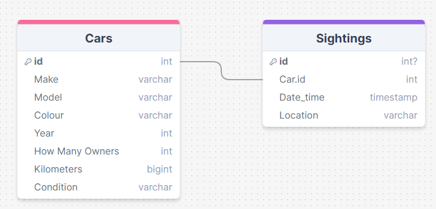
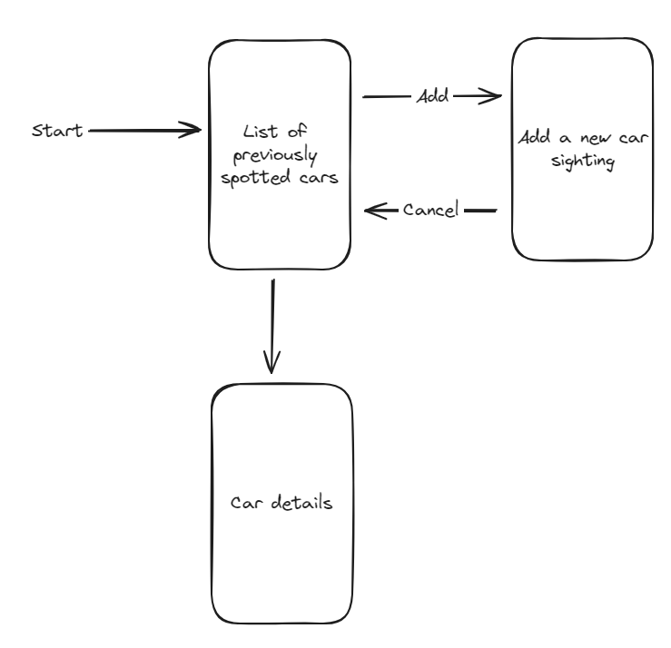
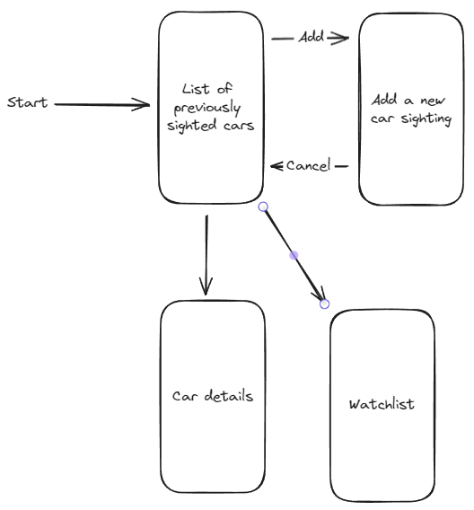

# Development of a Database-Linked Website for NCEA Level 2

Project Name: **Car Spotting Website**

Project Author: **Jayarn Sheridan**

Assessment Standards: **91892** and **91893**

-------------------------------------------------

## Design, Development and Testing Log

### 16.5.24

Working on my DataBase version 1.

I have worked on my database, i have gotten the car table and have gor 2 columns in so far 'Make' and 'Model', i have got the Sightings table done as well, the table has: id, Car.id, Date_time, and Location.

> If i was looking at spotting a car, some of the details i would like to know would be, what colour, what year, how many owners (if possible), kilometers travelled (if possible), and condition inside and out.

Database version 2.

I have followed my clients advice and have added more columns into my database table that have the names of what my client stated.

### 20.5.24

I am working on my User Interface design version 1.

I have made a outline of what my ui design could be, when the client opens up the website indicated by the word 'Start', they will be sent directly to a list of previously spotted cars, from there, there could be a add button to add a new car sighting to the site and a cancel button if they need to revert out of the new sighting page. When my client clicks/taps on a previously sighted car, it would come up with the car details.

>I suggested to add another box and make that a watchlist.

I listened to my clients advice and added another box and arrow which says 'Watchlist'.

### 21.5.24

I have done some minor changes to my UI flow design.

I have tweaked the colour of my boxes and i have added more arrows showing how the3 user will be able to get back out of the car details page and the watchlist page, i have also added a submit arrow for when a new car sighting is ready to be added.

### DATE HERE

Replace this test with what you are working on

Replace this text with brief notes describing what you worked on, any decisions you made, any changes to designs, etc. Add screenshots / links to other media to illustrate your notes where necessary.

### DATE HERE

Replace this test with what you are working on

Replace this text with brief notes describing what you worked on, any decisions you made, any changes to designs, etc. Add screenshots / links to other media to illustrate your notes where necessary.

### DATE HERE

Replace this test with what you are working on

Replace this text with brief notes describing what you worked on, any decisions you made, any changes to designs, etc. Add screenshots / links to other media to illustrate your notes where necessary.