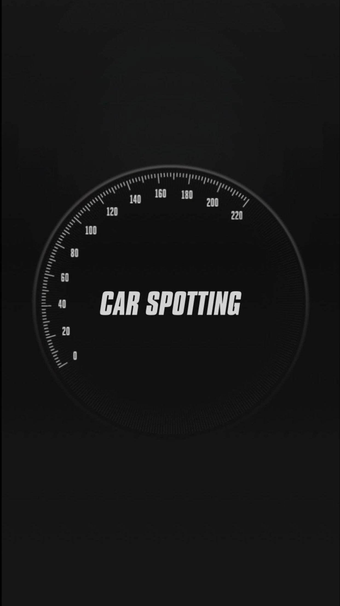

# Car Spotting

This is my Level 2 NCEA project for Digital Technologies

It is a database-connected website that allows users to:

- Allows the user to keep track of a car they have seen.
- Allows the user to add a car to the site.
- Allows the user to delete a car if needed.
- Feature 4 here
- Feature 5 here

## Documentation

The following documents support this project:

- [Design & Review](Design.md)
- [Development & Testing](Development.md)