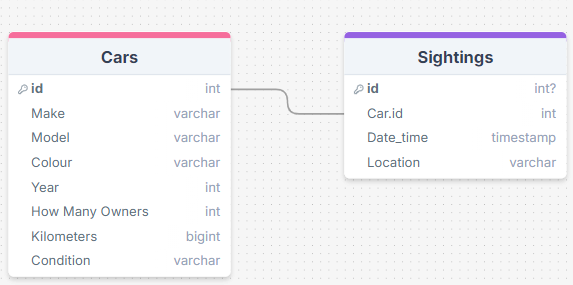
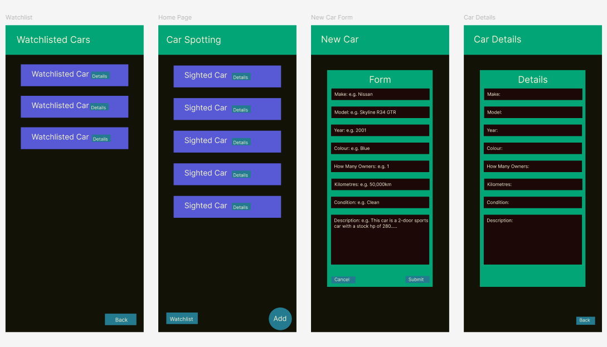
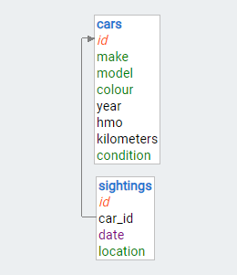
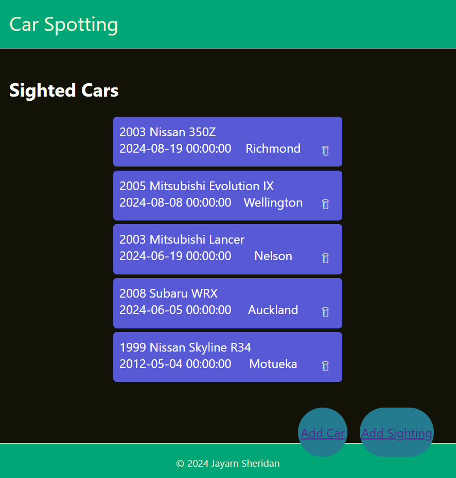

# The Design of a Database-Linked Website for NCEA Level 2

Project Name: **Car Spotting Website**

Project Author: **Jayarn Sheridan**

Assessment Standards: **91892** and **91893**

-------------------------------------------------

## System Requirements

### Identified Need or Problem

Car Enthusiasts/spotters are always looking out for cars weather its normal family 4-doors to 2-door sport cars. However it is not easy to keep track of all the cars that go by as they are all in different shapes, colours and are at different speeds meaning it may be hard to identify them. A website that could help the user keep track of the cars would be useful.

### End-User Requirements

The typical end-users that would use this website would be people that like cars, their specific needs could include an easy to use website, simple language, and good aesthetics - fonts, colours etc.

### Proposed Solution

A website that should allow the user to record sightings of different cars that the client would have seen on the road and put them into the website. The site should allow the client to do these things: 
- View the recorded sightings
- View a list of past recorded sightings 
- Add car sighting to the site.
- Add a new car to the system (database)
- Delete any unwanted sightings.

-------------------------------------------------

## Relevant Implications

### Usability

The usability implication means how hard or easy it is for the user to do what the site intends them to do. This is where Nielsen's 10 usability heuristics come in. these could include following standard conventions, making the behaviour logical and familiar, providing the end-user with a clear route forwards, and always making it obvious to the end-user what is happening. 

This implication is relevant to my major project because i need this website to be friendly to use, the people that use this site may not be very good at computer skills so i have to make it so the user knows and understands what is happening even if they aren't that skilled in IT equipment.

Moving forward, i will refer to nielsen's heuristics and try to make my UI design meet the standard of the heuristic as much as possible.need to consider how friendly the user interface is going to be at, the user interface should be easy to use, clients should be able to know what parts of the site they are working on. To make sure that the i have verified the UI is works properly, i will be testing it with my client and getting feedback about it to do any changes that may be required.

### Functionality

The functionality implication means does the website run?, is everything in working order?, does it meet the end-users purpose?, this implication should fully satisfy the original need / purpose, fully meet the users requirements, and make sure that it copes with all inputs.

This implication is important to my website as it shows that the website runs, i need to make the site run, have it run in working order and it needs to fully satisfy the clients need / purpose.

When moving forward i will need to consider about how the website will function, i will need to make it function right and in the correct order, i will have to make the functionality meets the purpose of what the client is wanting and how it will effect them. To verify this i will be testing with my client and getting feedback on any changes that would need to happen.

###  Aesthetics

The aesthetics implication means does it look good, does it have good colour and fonts? this implication should create an overall design that appeals to the end user, use colours that work effectively together to achieve a pleasing effect, and position items in a way that is balanced.

This implication is relevant to my project because i want my website to be appealing towards the user, i need to make sure that it looks good, has good fonts, and has an appropriate colour scheme that has similar colours for each page.

Moving forward i will need to consider how the page will look and will it follow normal design conventions, i will make it so that it will have appropriate colours and will follow the colour scheme of cars and spotting things. these colours will also have to appeal to my client, for this,i will be trying out a variety of colours and choosing the one that look best for my website.

###  End-Users

The end-users implication means does it meet the users specific needs, this implication should know as much as possible about your end-user

This implication is important for my website because i want my website to fully satisfy my end-users needs, my website should show what the end user is wanting and deliver it in a way that is friendly towards my user.

Looking forward i will need to consider my end-users, they may have different needs of the use of this site and i will have to make it clear to them that the website will be able to fulfil their specifications of need.

-------------------------------------------------

## Final System Design

### Database Structure

### User Interface Design

-------------------------------------------------

## Completed System

### Database Structure

### User Interface Design

-------------------------------------------------

## Review and Evaluation

### Meeting the Needs of the Users

Looking back at my website now, i believe that it has met the end users needs well,  

### Meeting the System Requirements

Replace this text with a brief evaluation of how well you met the requirements that you defined at the start of the project, etc. Look back at the list of features / functionality you initially set and discuss how well your system has implemented each one.

### Review of IMPLICATION NAME HERE

Replace this text with brief notes showing how the implication was addressed in the final outcome. Accompany the notes with screenshots / other media to illustrate specific features.

### Review of IMPLICATION NAME HERE

Replace this text with brief notes showing how the implication was addressed in the final outcome. Accompany the notes with screenshots / other media to illustrate specific features.

### Review of IMPLICATION NAME HERE

Replace this text with brief notes showing how the implication was addressed in the final outcome. Accompany the notes with screenshots / other media to illustrate specific features.

